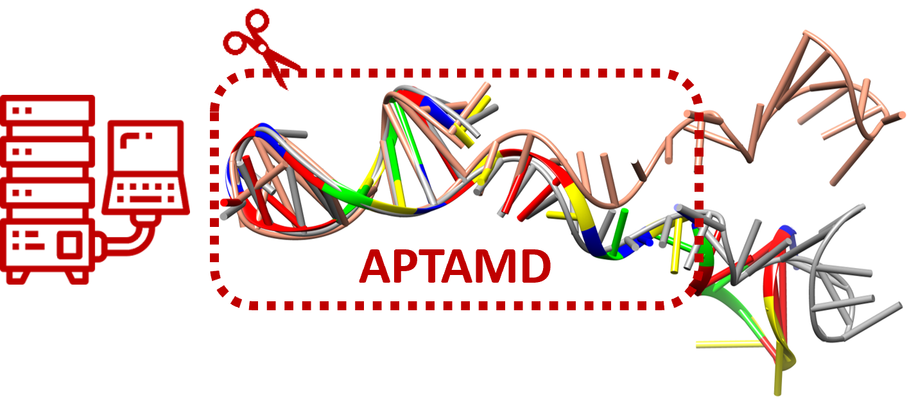

# **Introduction to Molecular Modeling of DNA Aptamers**

This collection of Jupyter notebooks was originally prepared  for a hands-on course imparted at the University of Oviedo by Natalia Díaz (diazfnatalia@uniovi.es) and Dimas Suárez (dimas@uniovi.es) in May 2026.  

### Installation

Clone this repository for downloading all the notebook files. 

Alternatively, you can view the notebook files online by using [nbviewer]() and inserting the URL of files in your ...

### Description 
This course is aimed at an audience of analytical chemists who wish to build realistic models of their DNA aptamers, but it may be also of interest to other graduate students.  It  presents a selection of basic concepts in Theoretical and Computational Chemistry that are required to understand  the modern molecular simulation methods  and their implementation in the form of computer tools. Focus is   placed on  the preparation, running and analysis of molecular dynamics (MD) simulations. Students will use various software tools including  the [Amber software](https://ambermd.org/), the [x3dna-dssr](https://x3dna.org/) program, the [Autodock suite](https://autodock.scripps.edu),   and   the driving scripts included in [APTAMD](https://github.com/dimassuarez/APTAMD).  

The  major learning goals  are :

* Understand the basic principles of biomolecular modeling techniques, know the AMBER programs that implement them as well as the requirements of computing power and data storage.
* Apply and, where appropriate, adapt standard computational protocols for the modeling of aptamers in aqueous solution. 
* Use databases and online computational tools for the construction of biomolecular models.
* Correctly and efficiently use a selection of molecular modeling techniques.
* Correctly interpret the structural and energetic results of MD simulations.

### Contents

The course is organized in 6 sessions that may require 3-4 h each. Students should have access to a Linux cluster providing  CPU/GPU resources for scientific computing.     

1. **Introduction to Linux OS** JupyterLab notebooks. Linux OS features. Secure connection to Linux systems. Basic Linux commands. Text editors. Job control. 
Case study: Analysis of PDB files of aptamer and ssDNA molecules.

2. **Construction of initial  models**  Structural elements of nucleic acids:  Role of water and ionic species. 2D model prediction. Prediction of initial 3D models. Visualization of 3D structures The problem of guanine quadruplets. Improvement of the initial models: APTAMD protocol. Case study: Obtaining 2D/3D structures from short aptameric sequences.

3. **Molecular mechanics**  Potential energy surfaces of biomolecules. Molecular Mechanics (MM) methods: Description of the AMBER potential. Solvation: representation of solvent and counterions. Periodic boundary conditions and long-range interactions. Model edition. Case study:  Complete edition of initial 3D models.

4. **Conformational sampling using molecular dynamics**  Fundamentals of molecular dynamics (MD). Temperature and pressure control: NVT/NPT simulations. Enhanced molecular dynamics (GaMD). Stages of an MD/GaMD simulation. Case study: Structural and energetic analysis of GaMD simulations.

5. **Analysis of MD simulations** : Structural and energetic descriptors. Clustering techniques . Amount of sampling and convergence of simulations. Case study: Application of the analysis methods using the APTAMD scripts.

6. **Aptamer-target complexes**: Prediction of non-covalent complexes: Docking algorithms. Autodock suite. Autodock4 within APTAMD. Parameterization of small molecules.  Limitations of the docking approaches. Case study: Preparation and execution of docking calculations in aptamers.

### Reference texts and content extension: 

* Tamar Schlick. *Molecular Modeling and Simulation*. (2nd edition) 2010. Springer.
* Berend Smit and Daan Frenkel. *Understanding Molecular Simulation: From Algorithms to Applications*. (3rd edition) 2023. Elsevier. 
* Andrew R. Leach. *Molecular Modelling: Principles and Applications*. (2nd edition). 2001. Prentice Hall. 

For more information on simulation methods and their application, the following  resources provide various tutorials: 
* https://ambermd.org/tutorials
* https://mmb.irbbarcelona.org/biobb/
* https://www.ebi.ac.uk/training/materials/biomolecular-simulations-materials/
* https://rosettacommons.github.io/PyRosetta.notebooks/ 
